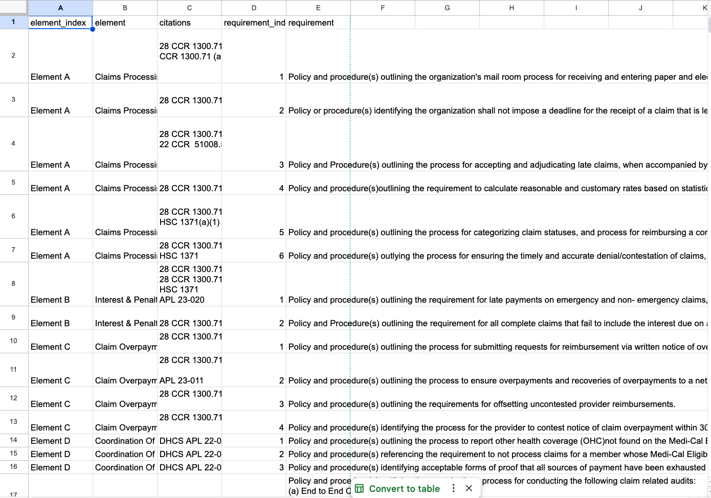

# About this Project

This was a part of a case study for the Readily team. 

<mark> The goal is to map the data from a CSV that health auditors might use into a structured data format for the Readily product. </mark>


In reflecting on the assignment, I have used pandas and numpy before, but spent some time reading the documentation as I could not remember any of the syntax.

The documentation was helpful as I was able to locate built in functions to trim blank values, search by a given pattern, and skip the top rows. 

I could see that there were two header rows within the tables provided - Element Row and Auditing/Requirement Element Rows and I spent the majority of my time thinking about how to get the tables split up based on the header row indices. 

I used Gemini for brainstorming and to help me remember how to do some simple things. I have included Gemini Prompts I used as well as some of the code from Gemini that I tested locally. 

# Files in this Project
 | Files | 
 | --------------------------------------------------- |
 | 1. create_health_requirement_csv.py   |
 | 2. Convert CSV Interview - pseudocode | 
 | 3. self_written.py - code I wrote myself |
 | 4. gemini-tested-code.py gemini produced code that I tested in developing this work |
 | 5. Gemini-prompts.txt - prompts that I asked Gemini in developing this. I did not use Cursor as I did not have any Cursor credits left for the day. |
 | 6. source.csv |

 # How to run:
 ```
 python create-health_requirement_csv.py
 ```

Self-written code:
```
python self_written.py
```

# Future Directions
For future considerations, I would make this more reusable. For instance, I hardcoded the number of rows to skip at the top of the file. This would make it hard to reuse this code unless every auditing spreadsheet is formatted the same. 

I would also add the ability to add a source file as an input argument into the file as part of the CLI.

I would also add more robust testing. To make this document reusable, would need more robust checking and tools to clean data. 

# How this was tested
I used console printing and manual checks to test this code worked against the document given.
6. 


# Resources Used:
1. [Pandas Documentation](https://pandas.pydata.org/docs/reference/api/pandas.read_csv.html)

2. [Read CSV File Containing Multiple Tables](https://stackoverflow.com/questions/34184841/python-pandas-read-csv-file-containing-multiple-tables)

3. Gemini Prompts and Code Assists Located in Gemini Prompts and Tested Code

4. [Select rows in series matching value](https://stackoverflow.com/questions/62397170/python-pandas-how-to-select-rows-where-objects-start-with-letters-pl)

5. [Adding Column Headers to new pandas dataframe](https://stackoverflow.com/questions/37038733/adding-column-headers-to-new-pandas-dataframe)

